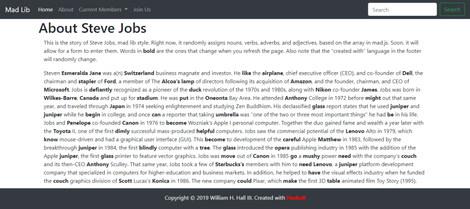

# practice

This is a simple HTML and javascript mad lib game. The words to use to replace the actual nouns, verbs, adverbs, ...etc., are stored in functions as arrays, and then returned randomly by the associated function. I then created one long template literal to print the story to the page. Each time you refresh the page, the story changes. I also added various programming languages to the footer section, by adding a language array inside the language function, and then randomly displaying them in the "Created with" section.

The project originally began as part of the supertable studygroup, so the nav bar includes names of several members of that group. Bootstrap is used as the template for the game 

# screenshot

# collaborators
Fall 2019(c) UofA bootcamp (mern stack)

Collaborator List : [Matthew, Bill]
